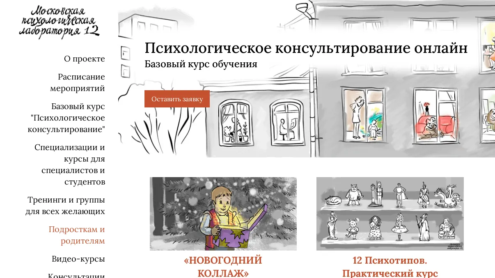

# MPL 12 Website

This repository contains the source code for a Laravel-based web application developed for a psychological consultation company. The application serves as both a website for promoting services and a custom CMS to manage content efficiently. The company specializes in training psychologists and offers various consultation services.

## Features

- **Custom CMS**: Fully-featured content management system to update and manage website content without technical expertise.
- **Responsive Design**: Ensures optimal user experience on all devices.
- **Training Modules**: Dedicated sections for psychologist training and workshops.
- **Service Management**: Easily add, update, or remove services offered by the company.
- **User-Friendly Interface**: Clean and intuitive UI for administrators and visitors.

## Screenshot



*The home page showcasing events.*

## Requirements

- PHP >= 8.0
- Composer
- Node.js and npm
- Laravel >= 9.x
- MySQL or compatible database

## Installation

1. Clone the repository:
   ```bash
   git clone https://github.com/NeoScripter/MPL-12.git
   cd MPL-12
   ```

2. Install dependencies:
   ```bash
   composer install
   npm install && npm run dev
   ```

3. Set up the environment variables:
   ```bash
   cp .env.example .env
   ```
   Update the `.env` file with your database credentials and other configuration details.

4. Generate application key:
   ```bash
   php artisan key:generate
   ```

5. Run migrations and seeders:
   ```bash
   php artisan migrate --seed
   ```

6. Start the development server:
   ```bash
   php artisan serve
   ```
   Visit `http://localhost:8000` to view the application.

## Usage

### Admin Panel
- Access the admin panel at `/admin`.
- Log in using the credentials created during seeding or registration.
- Manage services, training modules, and website content dynamically.

### Website
- Visitors can browse available services, register for training, and contact the company via the contact form.

## Technologies Used

- **Backend**: Laravel 11.x
- **Frontend**: Blade templates, TailwindCSS
- **Database**: MySQL
- **Other Tools**: npm, Composer

## Contribution

Contributions are welcome! If you'd like to suggest improvements or report bugs, feel free to create a pull request or open an issue.

## License

This project is licensed under the MIT License. See the `LICENSE` file for details.

## Contact

For inquiries or support, contact sange0337@gmail.com.
